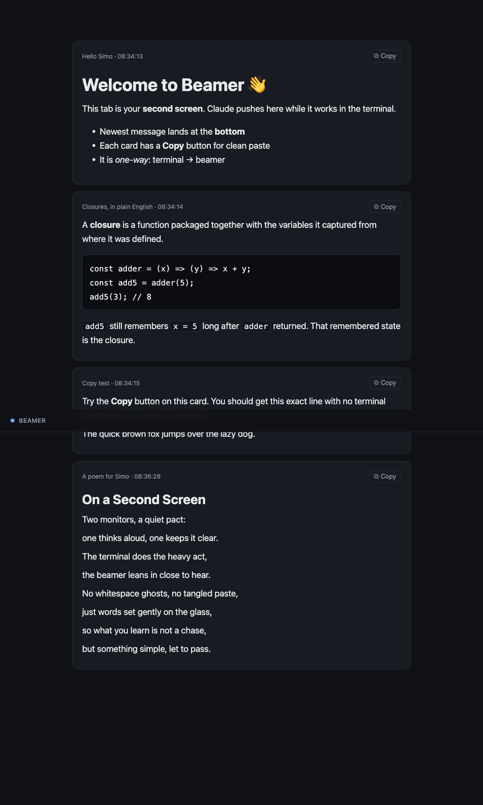

# Beamer

A second screen for Claude Code.

You work with Claude in a terminal on one monitor. Beamer gives you a browser tab on the other monitor where Claude can drop clean, readable text in real time. Explanations while you learn something. Summaries of what just happened. A snippet you want to copy without dragging half the terminal along with it.

Claude pushes, the tab shows it. That is the whole idea.

The name is a nod to *"Beam me up, Scotty"* from Star Trek. Claude beams text across to your other screen, and one of the notification sounds is a transporter shimmer for good measure.



## Why you might want this

Reading code review notes, lecture-style explanations, or long answers inside a scrolling terminal is uncomfortable. Copy-pasting a single sentence out of a terminal drags in stray whitespace and line wraps. So you end up asking Claude to "dump that into a file" just to read or copy it cleanly.

Beamer replaces that. Tell Claude to put something on the beamer and it shows up on your second screen as a tidy card, formatted, with a Copy button that hands you the exact text and nothing else.

## What you get

- A live feed on a browser tab. New cards arrive at the bottom and the page scrolls to them.
- Real Markdown. Headings, bold, lists, links, and code blocks all render.
- A Copy button on every card that copies the original clean text.
- An optional chime when a new card arrives, toggled with the bell in the top corner and remembered between visits. Pick from a handful of synthesized sounds in the dropdown next to it.
- A tidy feed. A bin icon on each card removes that one message, and Wipe in the top bar clears them all.
- Nothing to install. One small Python file, the kind already sitting on your Mac.
- Stays on your machine. It listens on `127.0.0.1` only and never touches the network.

## Requirements

Python 3. That is it. No `pip install`, no Node, no build step.

## Quick start

From the project folder:

```bash
# open the page (this also starts the server if it is not running)
./bin/beamer open

# send something to it
printf '# It works\n\nThis card is **live**.' | ./bin/beamer send --title "Hello"
```

Drag the tab to your second monitor and leave it there. If you forget to open one, `send` notices that no tab is connected and opens it for you.

Other commands:

```bash
./bin/beamer clear   # wipe the feed
./bin/beamer stop    # shut the server down
```

The page lives at `http://127.0.0.1:4040`. To use a different port, set `BEAMER_PORT` before any command.

## Use it with Claude Code

Link the skill so Claude can find it:

```bash
ln -s "$(pwd)/skills/beamer" ~/.claude/skills/beamer
```

Now just talk to Claude:

> "Walk through this auth flow and beam me a plain-English explanation of each step."

> "Summarize what you changed and send it to the beamer."

> "Put that paragraph on my second screen so I can copy it."

Claude starts the server the first time it needs it, so the only thing you do by hand is open the tab once.

## How it works

Three small pieces, each doing one job.

- **`beamer.py`** is the server. It keeps the messages in memory and pushes each new one to the browser over Server-Sent Events. Reload the tab and it replays what came before. Restart the server and the feed starts fresh.
- **`bin/beamer`** is the command Claude runs. It makes sure the server is up, then sends the text you piped in. Reading from a pipe keeps multi-line Markdown intact.
- **`web/`** is the page. A dark, roomy layout meant to be read from across the desk, with a tiny Markdown renderer so it needs no outside libraries.

## Test

```bash
python3 test/test_beamer.py
```

This boots the server, sends messages, confirms they reach a listener, and checks the page and its assets are served.

## License

MIT. Do what you like with it.
